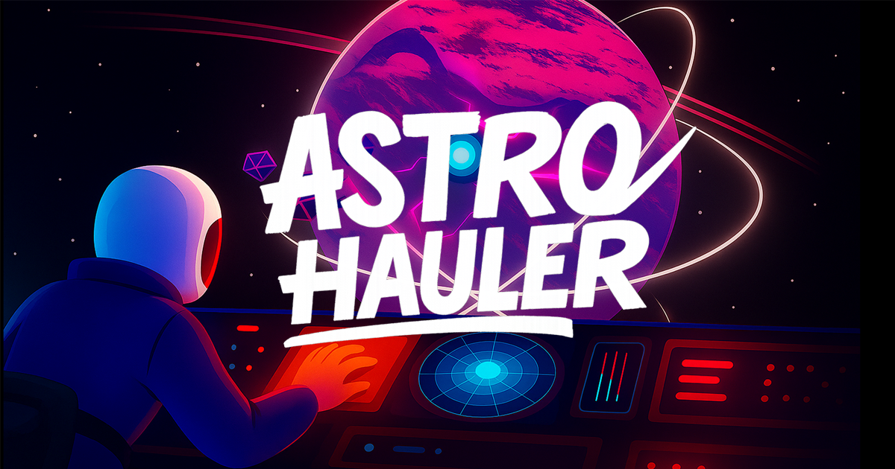

# AstroHauler



AstroHauler is a space salvaging game where you pilot a small ship, tether to debris, and haul it back to your parent ship for rewards. Use your ship's advanced tether technology to collect valuable salvage and earn SpaceBucks!

## Game Features

- **Physics-based space flight**: Navigate through space with realistic physics
- **Tether mechanics**: Attach to floating salvage and haul it back to your parent ship
- **Responsive controls**: Keyboard and touch controls for all devices
- **Mobile support**: Fully optimized for mobile play with custom touch controls

## Technology Stack

- [Phaser 3.88.2](https://github.com/phaserjs/phaser) - Game framework
- [React 18.2.0](https://github.com/facebook/react) - UI framework
- [TypeScript 5.2.2](https://github.com/microsoft/TypeScript) - Type-safe JavaScript
- [Vite 5.3.1](https://github.com/vitejs/vite) - Build tool and development server

## Game Controls

### Keyboard Controls
- **W** - Thrust forward
- **A** - Rotate left
- **D** - Rotate right
- **T** - Toggle tether (attach/detach)

### Touch Controls
The game automatically detects touch devices and displays touch controls:

- **Virtual Joystick** - Located in the lower-left corner:
  - Drag in any direction to rotate your ship
  - Dragging further from center increases rotation speed
  - A direction indicator arrow shows the rotation direction

- **Tether Button** - Located in the lower-right corner:
  - Tap to toggle tether (attach/detach)
  - Green when tether is active
  - White when tether is inactive

- **Thrust Button** - Located next to the tether button:
  - Press and hold to apply thrust
  - Thrust gradually increases while the button is held down

## Getting Started

### Development

```bash
# Install dependencies
npm install

# Start development server
npm run dev
```

The local development server runs on `http://localhost:8080` by default.

### Building for Production

```bash
# Create production build
npm run build
```

The production build will be available in the `dist` folder.

## Project Structure

- `src/` - Contains the React client source code
  - `components/` - React components
  - `game/` - Phaser game code
    - `scenes/` - Game scenes (MainMenu, Game, GameOver, etc.)
    - `objects/` - Game objects (Player, Salvage, ParentShip, Tether)
    - `config/` - Game configuration
- `public/assets/` - Game assets (images, audio, etc.)
  - `audio/` - Sound effects and music
  - `icons/` - Game icons
  - `images/` - Game images
  - `ui/` - UI elements
  - `vfx/` - Visual effects
  
## React-Phaser Communication

The game uses an EventBus to facilitate communication between React components and Phaser game objects:

```typescript
// In React
import { EventBus } from './game/EventBus';

// Emit an event
EventBus.emit('event-name', data);

// In Phaser
// Listen for an event
EventBus.on('event-name', (data) => {
    // Handle the event data
});
```

## License

This project is licensed under the MIT License - see the [LICENSE](LICENSE) file for details.
